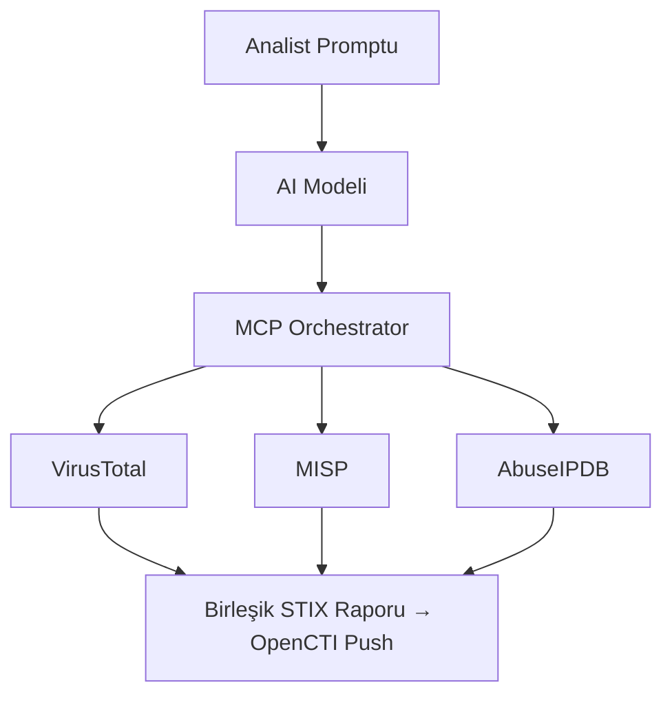

# MCP Sunucuları ile AI Destekli CTI — Fırsatlar ve Yeni Saldırı Yüzeyi

**Tarih:** Nisan 2026  
**Konu:** Model Context Protocol (MCP) + CTI Entegrasyonu  
**Etkilenen Araçlar:** MISP, VirusTotal, AbuseIPDB, GreyNoise, Feodo Tracker  
**Kategori:** CTI Operasyonu | Agentic AI | Yeni Tehdit Vektörü  
**Durum:** Aktif Benimseme — Güvenlik Riskleri Belgeleniyor ✔

## Özet

2026’nın en önemli CTI operasyon gelişmelerinden biri teknik bir araçtan değil, bir **paradigma değişikliğinden** geliyor: **Model Context Protocol (MCP)** sunucuları, yapay zeka modellerini gerçek zamanlı tehdit istihbaratı platformlarına bağlıyor.

Bu entegrasyon, analist iş akışını köklü biçimde hızlandırırken aynı anda henüz olgunlaşmamış yeni bir saldırı yüzeyi yaratıyor.

## Problem: Context Gap — Analistin En Büyük Düşmanı

AbuseIPDB → GreyNoise → MISP → Feodo Tracker…  
Tek bir gösterge için bile 15 dakika süren pivot zincirleri, vardiyalarda ve yüzlerce IoC içeren soruşturmalarda ciddi zaman kaybına yol açıyor. Bu yorucu döngünün adı: **Bağlam Açığı (Context Gap)**.

MCP sunucuları işte bu açığı kapatmayı hedefliyor.

## MCP Nedir? — Teknik Temel

Bir MCP sunucusu, yapay zeka modeline araçlar, veri kaynakları ve iş akışı şablonları sunan bir programdır.


MISP MCP sunucusu, AI modelinize MISP galaxy’leri (tehdit aktörleri, zararlı yazılımlar, araç eşlemeleri) ve gerçek dünya sightings verilerine erişim sağlar.

## Kazanımlar

- **Ölçekte Hız**: Gösterge başına 15 dakika süren pivot zincirleri ve araştırmalar saniyelere iniyor. Analistleri daha üst düzey analitik çalışmalar için serbest bırakıyor.
- **Sentezlenmiş Bağlam**: Beş ayrı sekmeden ham veri toplamak yerine, raporlamaya hazır yapılandırılmış ve tutarlı bir istihbarat tablosu elde ediliyor.
- **Yapılandırılmış Çıktılar**: STIX ve JSON formatında hazır çıktılar sayesinde AI destekli istihbarat, mevcut sistemlere (OpenCTI, SIEM vb.) sorunsuz entegre edilebiliyor.

## Yeni Saldırı Yüzeyi — Kritik Güvenlik Sorunları

MCP entegrasyonu büyük kazanımlar getirirken, aynı zamanda henüz yeterince belgelenmemiş yeni bir saldırı yüzeyi yaratıyor. Bazı vektörler aktif olarak gözlemlenmeye başlandı.

### Saldırı Vektörleri

1. **Truva Atlı MCP Sunucusu**  
   Sahte veya ele geçirilmiş bir MCP sunucusu, AI modeline yanlış IoC verileri besleyebilir, yanlış attribution yapılmasına neden olabilir veya gerçek tehdit verilerini gizleyebilir.

2. **Pasif Prompt Injection**  
   Tehdit raporlarına veya web sayfalarına gömülen gizli talimatlar, AI’ın araştırma yönünü değiştirebilir veya hassas veri sızdırabilir.

3. **AI-in-the-Middle **  
   MCP trafiği ağ düzeyinde şifrelenmediğinde, ortadaki bir aktör (Man-in-the-Middle) AI’ın aldığı tehdit istihbaratını manipüle edebilir.

   ## Temel Güvenlik Prensipleri

```markdown
✅ Her MCP sunucusunu bağımsız olarak doğrula
✅ MCP trafiği için TLS zorunlu kıl
✅ AI tarafından üretilen STIX çıktılarını insan gözden geçirmesine tabi tut
✅ MCP sorgularını ve yanıtlarını SIEM’de logla
✅ Her MCP sunucusu için en az ayrıcalık prensibi uygula

❌ Güvenilmeyen MCP sunucularına MISP kimlik bilgilerini verme
❌ AI çıktısını doğrulamadan otomatik IDS kuralı olarak yükleme
```

## Önerilen MCP Sunucuları

| Araç                    | Kapsam                              | Notlar                          |
|-------------------------|-------------------------------------|---------------------------------|
| MISP MCP                | Topluluk IoC + Galaxy               | Özel istihbarat için birincil   |
| MCP-ThreatIntel         | VirusTotal + AbuseIPDB              | Genel zenginleştirme            |
| fastmcp-threatintel     | Feodo Tracker + Botnet C2           | Pivot analizi                   |
| GreyNoise MCP           | Mass scanner tespiti                | Gürültü azaltma                 |

## CTI Analisti İçin Pratik Öneri

MCP sunucularını “değerlendirilecek bir özellik” olarak değil, **anlaşılması, yönetilmesi ve güvence altına alınması gereken altyapı** olarak ele almak gerekiyor. 

Bu alanı standart pratik haline gelmeden önce anlayan analistler önemli avantaj sağlayacak.

## Hızlı Başlangıç
```bash
# MISP MCP örnek entegrasyon
from mcp_client import MCPClient
import os

client = MCPClient(
    server="misp-mcp-server",
    auth_token=os.getenv("MISP_TOKEN"),
    tls_verify=True  # Zorunlu
)

# IoC pivot sorgusu
result = client.query(
    tool="misp_search",
    params={"value": "185.220.101.45", "type": "ip-src"}
)
```

## Kaynaklar

| # | Kaynak                                      | Tür                  | URL |
|---|---------------------------------------------|----------------------|-----|
| 1 | MCP Servers for CTI in 2026                 | Kapsamlı Analiz      | [https://kravensecurity.com/mcp-servers-for-cti/](https://kravensecurity.com/mcp-servers-for-cti/) |
| 2 | GitHub — MCP-ThreatIntel                    | Araç                 | [https://github.com/mrfakename/mcp-threatintel](https://github.com/mrfakename/mcp-threatintel) |
| 3 | MISP MCP Server                             | Araç                 | [https://github.com/MISP/misp-mcp](https://github.com/MISP/misp-mcp) |
| 4 | Model Context Protocol Spec                 | Protokol Dok.        | [https://modelcontextprotocol.io](https://modelcontextprotocol.io) |
| 5 | MISP Project Blog                           | Genel                | [https://www.misp-project.org/blog/](https://www.misp-project.org/blog/) |
| 6 | OpenCTI XTM Uzantısı (AI+MCP örneği)        | Ürün                 | [https://filigran.io/filigran-xtm-browser-extension/](https://filigran.io/filigran-xtm-browser-extension/) |

---

© 2025 AltHack Security — Gerçek Dünya Siber Güvenlik İstihbaratı
