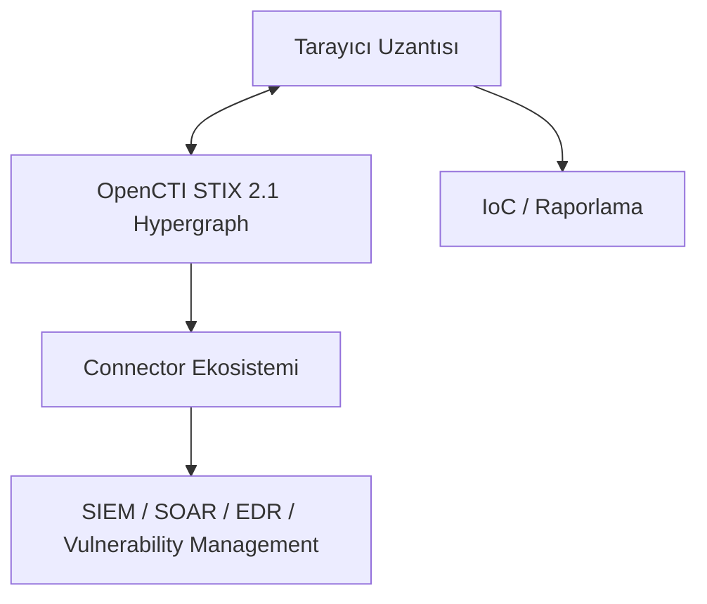

# OpenCTI v7 & Filigran XTM Suite — CTI'nin Yeni Nesil Altyapısı

**Tarih:** Şubat 2026 (v7 çıkışı)  
**En Son LTS:** 7.260309.0-lts.3 — 10 Nisan 2026  

**Platform:** OpenCTI (Filigran)  
**Kategori:** Threat Intelligence Platform (TIP)  
**Lisans:**  
- Community Edition → Apache 2.0  
- Enterprise Edition → Ticari  

**Durum:** Aktif Geliştirme — Production Ready ✔

## Özet

OpenCTI v7, müşteri ve CTI topluluğundan gelen sürekli geri bildirimler doğrultusunda büyük iyileştirmeler sunuyor. Bu sürümün öne çıkan yenilikleri:

- **Filigran XTM Tarayıcı Uzantısı** lansmanı
- OpenCTI v7 ile başlayan **Uzun Vadeli Destek (LTS)** programı
- Taslak modunda veri oluşturma ve düzenlemeyi kısıtlayan gelişmiş **Role Based Access Control (RBAC)**
- Artık doğrudan OpenCTI kullanıcı arayüzünden yönetilebilen **Single Sign-On (SSO)** desteği

OpenCTI, siber tehdit istihbaratı alanındaki en güçlü açık kaynak platformlarından biridir. Bu sürümle birlikte platform; izole bir istihbarat deposu olmaktan çıkıp, tarayıcıdan SIEM’e uzanan tam bir operasyonelleştirme zinciri kurmaya başladı.

## Teknik Yenilikler

### 1. Filigran XTM Tarayıcı Uzantısı

CTI analistlerinin çalışma pratiğini kökten değiştiren bu özellik, OpenCTI’yi doğrudan tarayıcıya taşıyor.

Uzantı, **OpenCTI** ve **OpenAEV** ile sorunsuz entegre çalışarak analistlerin tehdit verilerini herhangi bir web sayfasında tespit etmesine, zenginleştirmesine ve operasyonelleştirmesine olanak tanıyor.

**Özellikler:**
- Sayfa taraması (IP, domain, hash, CVE, MITRE ATT&CK teknikleri vb.)
- PDF tarama ve varlık vurgulaması
- Görsel renk kodlaması (yeşil = bilinen, sarı = yeni)
- Tek tıkla rapor, vaka ve soruşturma oluşturma
- Varlık önbelleği ve hızlı çevrimdışı tespit
- AI destekli açıklama üretimi (Enterprise Edition)

**Neden önemli?**  
Bir analist artık threat report okurken sekme değiştirmeye veya kopyala-yapıştır yapmaya gerek kalmadan ilgili IoC’leri anında OpenCTI’ye aktarabilir ve STIX 2.1 formatında yapılandırılmış rapor üretebilir.

### 2. LTS (Uzun Vadeli Destek) Programı

v7 ile birlikte başlatılan LTS programı, on-premise ve hava boşluklu ortamlarda çalışan kurumlar için **12 aylık tam destek** sağlıyor.

Özellikle kamu, savunma ve finans gibi katı güncelleme süreçleri olan sektörler için kritik önem taşıyor.

### 3. Gelişmiş API Token Yönetimi

- Kullanıcı başına **birden fazla token** oluşturma
- Token geçerlilik süresi ve kullanım izleme
- Token iptal (revoke) etme
- HMAC-hash ile güvenli depolama

### 4. Playbook Otomasyonu Genişletmesi

Playbook’lar artık:
- Mevcut değerleri **kaldırabilme**
- “**Tümünü kaldır**” seçeneği ile alanları toplu temizleme

Bu sayede otomasyonlar çok daha güvenilir ve bakım gerektirmeyen hale geliyor.

## CTI Analisti İçin Pratik Değer

| Senaryo                      | v6 Öncesi                  | v7 Sonrası                          |
|-----------------------------|----------------------------|-------------------------------------|
| Threat report IoC çıkarma   | Manuel kopyala-yapıştır    | Tarayıcı uzantısıyla tek tıklama    |
| Token güvenliği             | Tek plaintext token        | Çoklu HMAC token + revoke           |
| Playbook temizleme          | Manuel müdahale            | “Tümünü kaldır” otomasyonu          |
| SSO yönetimi                | Environment variable       | UI üzerinden self-service           |
| On-premise güncelleme       | Her sürüm için tam test    | LTS ile 12 aylık stabil pencere     |

## Mimari Genel Bakış


OpenCTI, taktiksel, teknik ve stratejik istihbarat katmanları genelinde siber tehdit istihbaratını yönetmek için değerli yetenekler sunuyor. STIX 2.1'i neredeyse tüm bütünlüğüyle tam olarak kullanan ender, hatta tek açık kaynak çözümlerinden biri. 

## Kurulum
```bash
# Docker Compose ile tam XTM suite
git clone https://github.com/OpenCTI-Platform/docker
cd docker
docker-compose up -d

# Tarayıcı uzantısı
# Chrome: Chrome Web Store → "Filigran eXtended Threat Management"
# Firefox/Edge: Manuel yükleme veya mağazadan
```

## CISA / Kurumsal Uyum Notu
OpenCTI, STIX 2.1 ve TAXII 2.1 standartlarını destekliyor; bu, ABD CISA'nın AIS (Automated Indicator Sharing) programıyla doğrudan entegrasyon imkânı sunuyor. MITRE ATT&CK haritalaması yerleşik olarak geliyor.

## Kaynaklar

| # | Kaynak                              | Tür              | URL                                                                 |
|---|-------------------------------------|------------------|---------------------------------------------------------------------|
| 1 | GitHub — OpenCTI Platform           | Birincil         | [https://github.com/OpenCTI-Platform/opencti](https://github.com/OpenCTI-Platform/opencti) |
| 2 | OpenCTI v7 Resmi Blog               | Birincil         | [https://filigran.io/opencti-v7/](https://filigran.io/opencti-v7/) |
| 3 | Filigran XTM Browser Extension      | Ürün Sayfası     | [https://filigran.io/filigran-xtm-browser-extension/](https://filigran.io/filigran-xtm-browser-extension/) |
| 4 | GitHub — XTM Browser Extension      | Kaynak Kodu      | [https://github.com/FiligranHQ/xtm-browser-extension](https://github.com/FiligranHQ/xtm-browser-extension) |
| 5 | OpenCTI Dokümantasyonu              | Teknik Dok.      | [https://docs.opencti.io/latest/](https://docs.opencti.io/latest/) |
| 6 | Chrome Web Store — Uzantı           | İndirme          | [https://chromewebstore.google.com/detail/filigran-extended-threat/ilblgjdkbijkefhfdhofhblkleagmabg](https://chromewebstore.google.com/detail/filigran-extended-threat/ilblgjdkbijkefhfdhofhblkleagmabg) |
| 7 | OpenCTI LTS Release Notes           | Changelog        | [https://github.com/OpenCTI-Platform/opencti/releases](https://github.com/OpenCTI-Platform/opencti/releases) |

---

© 2025 AltHack Security — Gerçek Dünya Siber Güvenlik İstihbaratı
